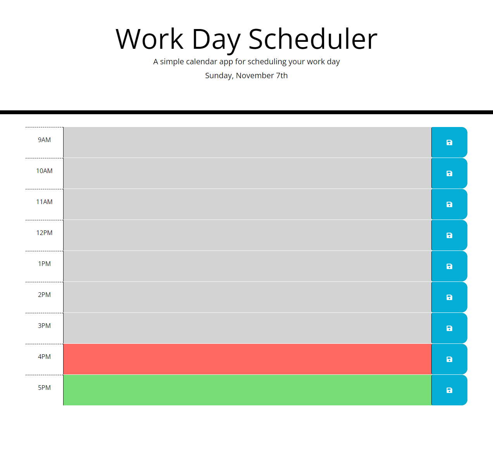

# Work Day Scheduler

## Description
Work Day Scheduler is an application designed to save user input within a set of time blocks using local storage. The blocks are color coded to show if an event is in the past, present, or future. This site uses Jquery, Moment.js, and Bootstrap.

## Website URL
https://ebtaterbug.github.io/work-day-scheduler/

 
